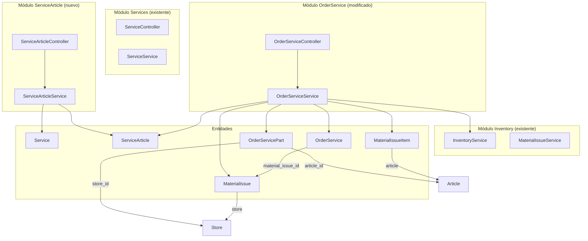
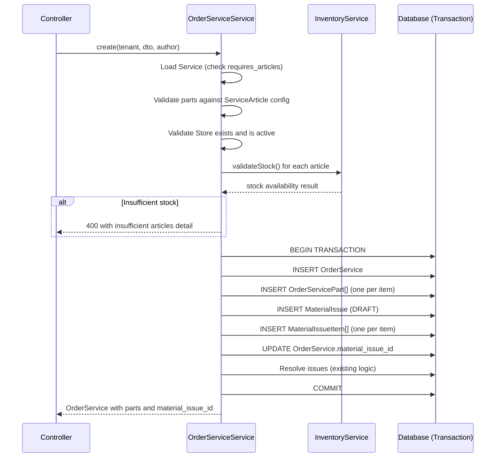

# Design Document: Service Parts Requirement

## Overview

Este diseño agrega la capacidad de parametrizar artículos (partes de recambio) en los servicios del catálogo de FixSite y gestionar automáticamente su consumo de inventario al asignar servicios a órdenes de reparación.

El flujo principal es:
1. El administrador marca un Service con `requires_articles = true`
2. Configura qué artículos puede usar ese servicio via `ServiceArticle`
3. Al crear un `OrderService` para un servicio que requiere artículos, el técnico indica las partes y el almacén
4. El sistema valida stock, crea registros `OrderServicePart`, y genera un `MaterialIssue` en DRAFT
5. El inventario se descuenta solo cuando el `MaterialIssue` es aprobado manualmente (flujo existente)

**Decisiones clave:**
- El MaterialIssue se crea en DRAFT (no se aprueba automáticamente) para mantener la separación de responsabilidades del dominio de inventario
- La validación de stock es un "pre-check" informativo que ocurre antes de la transacción pero no garantiza reserva (otro proceso podría consumir stock entre validación y aprobación)
- Se usa un único `store_id` por request (todas las partes salen del mismo almacén)

## Architecture



### Flujo de creación de OrderService con partes



## Components and Interfaces

### 1. ServiceArticle Module (nuevo)

**Ubicación:** `src/modules/service-article/`

```
src/modules/service-article/
├── service-article.controller.ts
├── service-article.service.ts
├── service-article.module.ts
└── dto/
    ├── create-service-article.dto.ts
    └── update-service-article.dto.ts
```

**ServiceArticleController** — CRUD de configuración de artículos por servicio.

```typescript
@Controller('service-articles')
@UseGuards(TenantSelectionGuard)
export class ServiceArticleController {
  // GET /service-articles?service_id=X&page=&limit=&filter=
  findAll(tenant, query: PaginationQueryDto & { service_id: number })

  // POST /service-articles
  create(tenant, dto: CreateServiceArticleDto)

  // PATCH /service-articles/:id
  update(tenant, id: number, dto: UpdateServiceArticleDto)

  // DELETE /service-articles/:id
  remove(tenant, id: number)
}
```

**ServiceArticleService** — Lógica de negocio para gestión de artículos por servicio.

```typescript
@Injectable()
export class ServiceArticleService {
  findAll(tenant, serviceId: number, page, limit, filter?): Promise<{ items, total }>
  create(tenant, dto: CreateServiceArticleDto): Promise<ServiceArticle>
  update(tenant, id: number, dto: UpdateServiceArticleDto): Promise<ServiceArticle>
  remove(tenant, id: number): Promise<void>
  // Utilizado internamente por OrderServiceService
  validateArticlesForService(tenant, serviceId: number, articleIds: number[]): Promise<void>
}
```

### 2. OrderService Module (modificado)

**Cambios en `OrderServiceService.create()`:**
- Nuevo parámetro en DTO: `parts[]` y `store_id`
- Validación condicional basada en `service.requires_articles`
- Stock validation pre-transacción
- Creación de `OrderServicePart[]` dentro de la transacción
- Creación de `MaterialIssue` + `MaterialIssueItem[]` dentro de la transacción
- Almacenamiento de `material_issue_id` en OrderService

**Cambios en `OrderServiceService.remove()`:**
- Si `material_issue_id` existe y MI está en DRAFT/PENDING → cancelar MI
- Si MI está en APPROVED → bloquear eliminación con error 400
- Eliminación de `OrderServicePart[]` en la misma transacción

### 3. InventoryService (existente, sin cambios)

Se usa tal cual:
- `validateStock(tenant, article_id, store_id, requiredQuantity)` — pre-check
- `getStock(tenant, article_id, store_id)` — para error reporting

## Data Models

### Nuevas entidades

#### ServiceArticle (tabla: `service_articles`)

```typescript
@Entity('service_articles')
@Unique(['service_id', 'article_id'])
export class ServiceArticle {
  @PrimaryGeneratedColumn()
  id: number;

  @Column()
  service_id: number;

  @ManyToOne(() => Service, { nullable: false })
  @JoinColumn({ name: 'service_id' })
  service: Service;

  @Column()
  article_id: number;

  @ManyToOne(() => Article, { nullable: false })
  @JoinColumn({ name: 'article_id' })
  article: Article;

  @Column('decimal', { precision: 10, scale: 2 })
  default_quantity: number;

  @Column({ default: true })
  is_active: boolean;

  @CreateDateColumn()
  createdAt: Date;

  @UpdateDateColumn()
  updatedAt: Date;
}
```

#### OrderServicePart (tabla: `order_service_parts`)

```typescript
@Entity('order_service_parts')
export class OrderServicePart {
  @PrimaryGeneratedColumn()
  id: number;

  @Column()
  order_service_id: number;

  @ManyToOne(() => OrderService, { nullable: false, onDelete: 'CASCADE' })
  @JoinColumn({ name: 'order_service_id' })
  orderService: OrderService;

  @Column()
  article_id: number;

  @ManyToOne(() => Article, { nullable: false })
  @JoinColumn({ name: 'article_id' })
  article: Article;

  @Column('int')
  quantity: number;

  @Column()
  store_id: number;

  @ManyToOne(() => Store, { nullable: false })
  @JoinColumn({ name: 'store_id' })
  store: Store;

  @CreateDateColumn()
  createdAt: Date;

  @UpdateDateColumn()
  updatedAt: Date;
}
```

### Modificaciones a entidades existentes

#### Service (agregar campo)

```typescript
// Agregar a service.entity.ts
@Column({ default: false })
requires_articles: boolean;

@OneToMany(() => ServiceArticle, sa => sa.service)
serviceArticles: ServiceArticle[];
```

#### OrderService (agregar campo y relación)

```typescript
// Agregar a order-service.entity.ts
@Column({ nullable: true })
material_issue_id: number;

@ManyToOne(() => MaterialIssue, { nullable: true })
@JoinColumn({ name: 'material_issue_id' })
materialIssue: MaterialIssue;

@OneToMany(() => OrderServicePart, osp => osp.orderService)
parts: OrderServicePart[];
```

### Database Schema

#### Nueva tabla: `service_articles`

| Column | Type | Constraints |
|--------|------|-------------|
| id | serial | PK |
| service_id | integer | NOT NULL, FK → services.id |
| article_id | integer | NOT NULL, FK → articles.id |
| default_quantity | decimal(10,2) | NOT NULL |
| is_active | boolean | NOT NULL, DEFAULT true |
| createdAt | timestamp | NOT NULL, DEFAULT now() |
| updatedAt | timestamp | NOT NULL, DEFAULT now() |

**Constraints:** UNIQUE(service_id, article_id)

#### Nueva tabla: `order_service_parts`

| Column | Type | Constraints |
|--------|------|-------------|
| id | serial | PK |
| order_service_id | integer | NOT NULL, FK → order_services.id ON DELETE CASCADE |
| article_id | integer | NOT NULL, FK → articles.id |
| quantity | integer | NOT NULL, CHECK(quantity >= 1 AND quantity <= 9999) |
| store_id | integer | NOT NULL, FK → stores.id |
| createdAt | timestamp | NOT NULL, DEFAULT now() |
| updatedAt | timestamp | NOT NULL, DEFAULT now() |

#### Modificación: tabla `services`

| Column | Type | Constraints |
|--------|------|-------------|
| requires_articles | boolean | NOT NULL, DEFAULT false |

#### Modificación: tabla `order_services`

| Column | Type | Constraints |
|--------|------|-------------|
| material_issue_id | integer | NULLABLE, FK → material_issues.id |

### DTOs

#### CreateServiceArticleDto

```typescript
export class CreateServiceArticleDto {
  @IsInt()
  service_id: number;

  @IsInt()
  article_id: number;

  @IsNumber({ maxDecimalPlaces: 2 })
  @Min(0.01)
  @Max(9999.99)
  default_quantity: number;

  @IsOptional()
  @IsBoolean()
  is_active?: boolean;
}
```

#### UpdateServiceArticleDto

```typescript
export class UpdateServiceArticleDto {
  @IsOptional()
  @IsNumber({ maxDecimalPlaces: 2 })
  @Min(0.01)
  @Max(9999.99)
  default_quantity?: number;

  @IsOptional()
  @IsBoolean()
  is_active?: boolean;
}
```

#### OrderServicePartDto (nested en CreateOrderServiceDto)

```typescript
export class OrderServicePartDto {
  @IsInt()
  @Min(1)
  article_id: number;

  @IsInt()
  @Min(1)
  @Max(10000)
  quantity: number;
}
```

#### CreateOrderServiceDto (modificado)

```typescript
export class CreateOrderServiceDto {
  @IsInt()
  order_id: number;

  @IsInt()
  service_id: number;

  @IsOptional()
  @IsArray()
  @IsInt({ each: true })
  issue_ids?: number[];

  @IsOptional()
  @IsNumber()
  price?: number;

  @IsOptional()
  @IsInt()
  estimated_minutes?: number;

  @IsOptional()
  @IsString()
  notes?: string;

  @IsOptional()
  @IsArray()
  @ArrayMaxSize(50)
  @ValidateNested({ each: true })
  @Type(() => OrderServicePartDto)
  parts?: OrderServicePartDto[];

  @IsOptional()
  @IsInt()
  @Min(1)
  store_id?: number;
}
```

### API Endpoints

#### ServiceArticle CRUD

| Method | Route | Description | Request | Response |
|--------|-------|-------------|---------|----------|
| GET | `/service-articles?service_id=X&page=&limit=&filter=` | Listar artículos de un servicio | Query params | `{ data: ServiceArticle[], pagination }` |
| POST | `/service-articles` | Crear configuración | `CreateServiceArticleDto` | `{ data: ServiceArticle }` |
| PATCH | `/service-articles/:id` | Actualizar cantidad/estado | `UpdateServiceArticleDto` | `{ data: ServiceArticle }` |
| DELETE | `/service-articles/:id` | Eliminar configuración | - | `{ data: null }` |

#### OrderService (modificaciones)

| Method | Route | Changes |
|--------|-------|---------|
| POST | `/orders-service/create` | Acepta `parts[]` y `store_id` opcionales |
| GET | `/orders-service/:id` | Incluye `parts[]` con article y store |
| GET | `/orders-service/order/:order_id` | Incluye `parts[]` en cada servicio |
| DELETE | `/orders-service/:id` | Valida estado de MI, cancela si DRAFT/PENDING |

**Ejemplo request POST /orders-service/create (con partes):**

```json
{
  "order_id": 1,
  "service_id": 5,
  "issue_ids": [10, 11],
  "price": 150.00,
  "estimated_minutes": 60,
  "store_id": 2,
  "parts": [
    { "article_id": 3, "quantity": 2 },
    { "article_id": 7, "quantity": 1 }
  ]
}
```

**Ejemplo response (con partes):**

```json
{
  "success": true,
  "status": 201,
  "message": "Servicio asignado exitosamente",
  "data": {
    "id": 42,
    "order_id": 1,
    "service_id": 5,
    "price": 150.00,
    "estimated_minutes": 60,
    "material_issue_id": 15,
    "parts": [
      {
        "id": 1,
        "article_id": 3,
        "quantity": 2,
        "store_id": 2,
        "article": { "id": 3, "name": "Pantalla LCD", "sku": "SCR-001" },
        "store": { "id": 2, "name": "Bodega Principal" }
      },
      {
        "id": 2,
        "article_id": 7,
        "quantity": 1,
        "store_id": 2,
        "article": { "id": 7, "name": "Flex Cable", "sku": "FLX-003" },
        "store": { "id": 2, "name": "Bodega Principal" }
      }
    ],
    "service": { "id": 5, "description": "Cambio de pantalla", "code": "SRV-005" },
    "issues": [...]
  }
}
```

**Error response (stock insuficiente):**

```json
{
  "success": false,
  "status": 400,
  "message": "Stock insuficiente para completar la solicitud",
  "errors": [
    { "article_id": 3, "required": 2, "available": 0 },
    { "article_id": 7, "required": 1, "available": 0 }
  ]
}
```

## Correctness Properties

*A property is a characteristic or behavior that should hold true across all valid executions of a system — essentially, a formal statement about what the system should do. Properties serve as the bridge between human-readable specifications and machine-verifiable correctness guarantees.*

### Property 1: Service `requires_articles` persistence round-trip

*For any* Service and any boolean value V, if `requires_articles` is set to V during create or update, then retrieving that Service should return `requires_articles` equal to V. Additionally, *for any* update that omits `requires_articles`, the previously stored value should remain unchanged.

**Validates: Requirements 1.2, 1.4**

### Property 2: ServiceArticle unique constraint enforcement

*For any* Service and Article, creating a second ServiceArticle record with the same `(service_id, article_id)` combination should be rejected with a conflict error, regardless of other field values.

**Validates: Requirements 2.2, 2.7**

### Property 3: ServiceArticle creation requires `requires_articles=true`

*For any* Service with `requires_articles` set to `false`, any attempt to create a ServiceArticle referencing that Service should be rejected with a 400 error.

**Validates: Requirements 2.3**

### Property 4: ServiceArticle creation requires active Article

*For any* Article that does not exist or has `active=false`, any attempt to create a ServiceArticle referencing that Article should be rejected with a 400 error.

**Validates: Requirements 2.4**

### Property 5: ServiceArticle `default_quantity` range validation

*For any* numeric value outside the range [0.01, 9999.99], creating or updating a ServiceArticle with that `default_quantity` should be rejected with a validation error.

**Validates: Requirements 2.8**

### Property 6: Parts required when `requires_articles=true`

*For any* Service with `requires_articles=true`, creating an OrderService without a non-empty `parts` array should be rejected with a 400 error.

**Validates: Requirements 3.1, 3.2**

### Property 7: Parts ignored when `requires_articles=false`

*For any* Service with `requires_articles=false`, creating an OrderService should succeed regardless of whether `parts` and `store_id` are provided or omitted. If provided, parts should be ignored.

**Validates: Requirements 3.3, 7.5**

### Property 8: Parts article_id validation against service configuration

*For any* `parts` array item where the `article_id` is not present in the ServiceArticle configuration for that Service, or where the ServiceArticle record has `is_active=false`, the OrderService creation should be rejected with a 400 error identifying the invalid article.

**Validates: Requirements 3.4, 3.5**

### Property 9: Parts quantity validation

*For any* `parts` array item where `quantity` is not an integer, or is less than 1, or is greater than 10,000, the OrderService creation should be rejected with a validation error.

**Validates: Requirements 3.6**

### Property 10: Parts duplicate article_id rejection

*For any* `parts` array containing two or more items with the same `article_id`, the OrderService creation should be rejected with a 400 error indicating duplicate articles are not allowed.

**Validates: Requirements 3.7**

### Property 11: OrderServicePart count invariant

*For any* successful OrderService creation with a `parts` array of length N, exactly N OrderServicePart records should be persisted, each matching the corresponding item's `article_id`, `quantity`, and the request's `store_id`.

**Validates: Requirements 4.2**

### Property 12: OrderServicePart cascade deletion

*For any* OrderService with associated OrderServicePart records, after successful deletion of the OrderService, zero OrderServicePart records referencing that OrderService should exist in the database.

**Validates: Requirements 4.4**

### Property 13: MaterialIssue auto-creation correctness

*For any* successful OrderService creation with parts, the system should create exactly one MaterialIssue in DRAFT status, with one MaterialIssueItem per part matching article_id and quantity, and the OrderService's `material_issue_id` should reference that MaterialIssue.

**Validates: Requirements 5.1, 5.3, 5.5**

### Property 14: MaterialIssue cancellation on OrderService deletion

*For any* OrderService with a linked MaterialIssue in DRAFT or PENDING status, deleting the OrderService should result in the MaterialIssue transitioning to CANCELLED status.

**Validates: Requirements 5.6**

### Property 15: OrderService deletion blocked when MaterialIssue is approved

*For any* OrderService with a linked MaterialIssue in APPROVED status, attempting to delete the OrderService should be rejected with a 400 error.

**Validates: Requirements 5.7**

### Property 16: Stock validation blocks insufficient stock

*For any* `parts` array where at least one article has insufficient stock in the specified store, the OrderService creation should be rejected with a 400 error listing ALL articles with insufficient stock, including for each the `article_id`, required quantity, and available quantity.

**Validates: Requirements 6.1, 6.2, 6.5**

### Property 17: Store validation

*For any* `store_id` that references a non-existent or inactive Store, creating an OrderService with parts should be rejected with a 400 error.

**Validates: Requirements 7.2, 7.3**

### Property 18: Store_id propagation consistency

*For any* successful OrderService creation with parts and a valid `store_id`, all resulting OrderServicePart records and the generated MaterialIssue entity should reference the same `store_id`.

**Validates: Requirements 7.4**

## Error Handling

| Scenario | HTTP Status | Error Message |
|----------|-------------|---------------|
| Service not found | 404 | `Servicio con ID {id} no encontrado` |
| Article not found or inactive | 400 | `El artículo con ID {id} no está disponible` |
| Service does not allow articles | 400 | `El servicio no permite configuración de artículos (requires_articles = false)` |
| Duplicate ServiceArticle | 409 | `El artículo ya está configurado para este servicio` |
| default_quantity out of range | 400 | Validation error from class-validator |
| Parts required but missing | 400 | `Este servicio requiere partes. Debe incluir un array 'parts' no vacío` |
| Article not in service config | 400 | `El artículo {id} no está permitido para este servicio` |
| Duplicate article in parts | 400 | `No se permiten artículos duplicados en la misma solicitud` |
| Quantity invalid | 400 | Validation error from class-validator |
| Store not found or inactive | 400 | `El almacén con ID {id} no existe o está inactivo` |
| Insufficient stock | 400 | `Stock insuficiente para completar la solicitud` (with details array) |
| Deletion blocked (MI approved) | 400 | `No se puede eliminar: el egreso de material ya fue aprobado` |
| store_id missing when parts required | 400 | `Debe especificar store_id cuando se incluyen partes` |

### Transaction Rollback Scenarios

- Si falla la creación de `OrderServicePart` → rollback completo (OrderService no persiste)
- Si falla la creación de `MaterialIssue` → rollback completo
- Si falla la creación de `MaterialIssueItem` → rollback completo
- Si falla la resolución de issues → rollback completo

## Testing Strategy

### Unit Tests (example-based)

- Service entity: campo `requires_articles` persiste con default `false`
- ServiceArticle CRUD: creation, update, deletion basic flows
- OrderService creation sin partes (service sin `requires_articles`) funciona como antes
- Response shape incluye `parts[]` y `material_issue_id`
- Error messages correctos para cada escenario de validación

### Property-Based Tests

**Library:** fast-check (TypeScript PBT library)
**Minimum iterations:** 100 per property

Propiedades a implementar:
- **Property 2**: Unique constraint — generar pares (service_id, article_id), insertar dos veces, verificar error en segunda
- **Property 6**: Parts required — generar Services con `requires_articles=true`, intentar crear OrderService sin parts
- **Property 7**: Parts ignored — generar Services con `requires_articles=false`, crear con/sin parts, verificar éxito
- **Property 9**: Quantity validation — generar cantidades fuera de rango, verificar rechazo
- **Property 10**: Duplicate detection — generar arrays con duplicados, verificar rechazo
- **Property 11**: Count invariant — generar arrays de 1-50 items válidos, verificar count exacto de OrderServicePart
- **Property 16**: Stock validation — generar combinaciones de stock y requerimientos, verificar comportamiento correcto
- **Property 18**: Store propagation — generar requests válidos, verificar store_id en todos los registros

Each test tagged with: `// Feature: service-parts-requirement, Property {N}: {description}`

### Integration Tests

- Flujo completo: crear Service → configurar articles → crear OrderService con parts → verificar MaterialIssue en DRAFT
- Eliminar OrderService → verificar MI cancelado y OrderServicePart eliminados
- Eliminar OrderService con MI aprobado → verificar bloqueo
- Stock check con inventario real usando `InventoryService`
